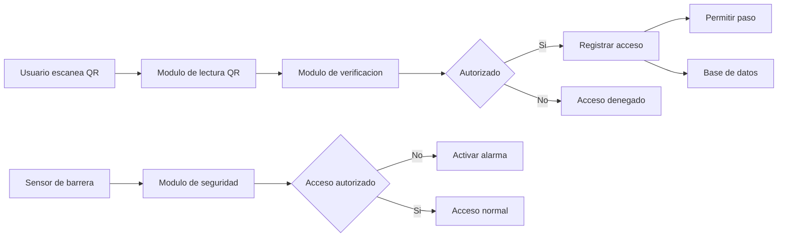

Proyecto: Smart Cafeteria Access System  
Autor: Brenda Romero

# Arquitectura del Sistema

## Descripción

El sistema está diseñado como una arquitectura modular para permitir la identificación de usuarios mediante códigos QR, verificación de autorización y registro de accesos al comedor escolar.

La arquitectura permite reemplazar o mejorar módulos sin afectar el funcionamiento general del sistema.

---

## Arquitectura General

## Módulos del Sistema
### Módulo de lectura QR

Encargado de capturar la imagen desde la cámara y detectar códigos QR.

### Módulo de verificación

Consulta la base de datos para determinar si el usuario puede acceder.

### Módulo de registro

Guarda los registros de acceso.

### Módulo de seguridad

Monitorea sensores para detectar accesos no autorizados.

### Módulo de interfaz

Muestra mensajes al operador del comedor.