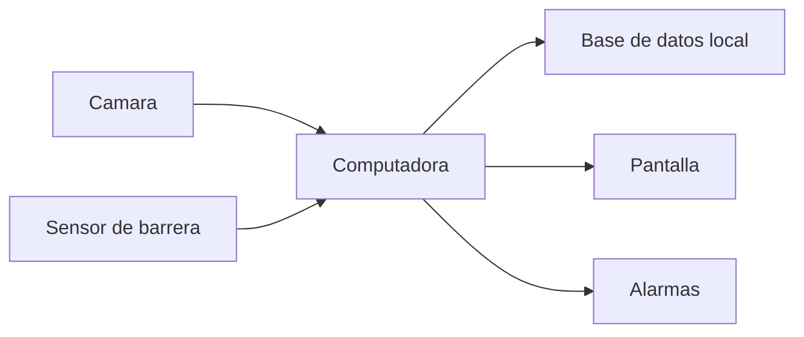

Proyecto: Smart Cafeteria Access System  
Autor: Brenda Romero
# Diseño de Hardware

## Objetivo

Definir los componentes de hardware necesarios para implementar el sistema de control de acceso al comedor escolar.

---

## Componentes principales

### Computadora o sistema embebido

Responsable de ejecutar el software del sistema.

Opciones posibles:

- Mini PC
- Raspberry Pi
- Computadora existente del comedor

---

### Cámara

Permite capturar los códigos QR de los carnets.

Requisitos:

- Cámara USB
- Resolución suficiente para lectura de QR
- Montaje fijo en la entrada del comedor

---

### Sensor de barrera

Detecta cuando una persona atraviesa la entrada.

Opciones:

- Sensor infrarrojo
- Barrera láser

---

### Alarma sonora

Se activa cuando se detecta un acceso no autorizado.

Opciones:

- Buzzer
- Pequeño parlante

---

### Monitor o pantalla

Muestra el estado del acceso.

Ejemplos de mensajes:

- Acceso permitido
- Usuario no autorizado
- Servicio ya utilizado

---
## Diagrama de hardware

## Consideraciones ambientales

El sistema debe diseñarse considerando:

- Temperaturas de hasta 32°C

- Alta humedad

- Posible exposición a lluvia

- Uso intensivo durante horarios de almuerzo