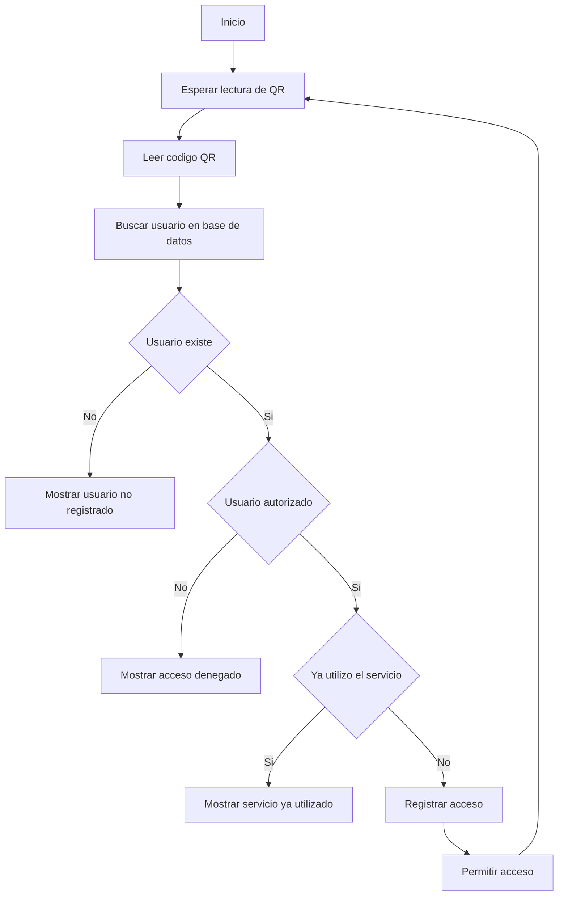

Proyecto: Smart Cafeteria Access System  
Autor: Brenda Romero

# Flujo del Sistema

## Flujo de Operación

El siguiente diagrama describe el proceso desde que un usuario escanea su código QR hasta la autorización o denegación de acceso.

